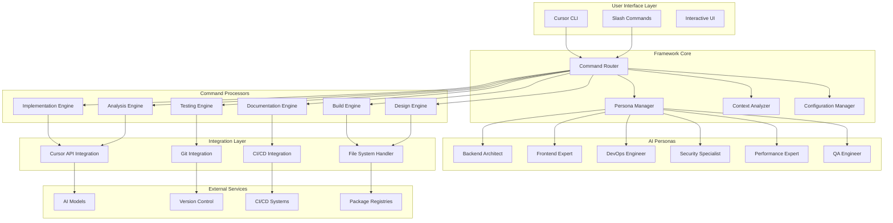

# Design Document

## Overview

The SuperCursor Framework is a comprehensive extension system that enhances Cursor CLI with specialized development commands, intelligent AI personas, and advanced automation capabilities. The framework follows a modular architecture that integrates seamlessly with Cursor's existing infrastructure while providing powerful new functionality for modern development workflows.

## Architecture

### High-Level Architecture



### Core Components

#### 1. Command Router
- **Purpose**: Central dispatcher for all framework commands
- **Responsibilities**:
  - Parse and validate slash commands
  - Route commands to appropriate processors
  - Handle command chaining and composition
  - Manage command history and caching

#### 2. Persona Manager
- **Purpose**: Intelligent context-aware AI persona selection
- **Responsibilities**:
  - Analyze current development context
  - Select and activate appropriate personas
  - Manage persona switching and combinations
  - Maintain persona-specific knowledge bases

#### 3. Context Analyzer
- **Purpose**: Deep understanding of project context and developer intent
- **Responsibilities**:
  - Analyze codebase structure and patterns
  - Identify technology stacks and frameworks
  - Track development workflow patterns
  - Maintain project knowledge graph

#### 4. Configuration Manager
- **Purpose**: Flexible configuration and permission management
- **Responsibilities**:
  - Load and validate configuration files
  - Manage environment-specific settings
  - Handle permission and security policies
  - Provide configuration hot-reloading

## Components and Interfaces

### Command Processors

#### Implementation Engine (`/sc:implement`)
```typescript
interface ImplementationEngine {
  generateCode(specification: string, context: ProjectContext): Promise<CodeGeneration>;
  analyzeRequirements(description: string): Promise<RequirementAnalysis>;
  createScaffolding(template: string, options: ScaffoldOptions): Promise<ProjectStructure>;
  integrateWithExisting(newCode: string, existingContext: CodeContext): Promise<Integration>;
}

interface CodeGeneration {
  files: GeneratedFile[];
  dependencies: Dependency[];
  configurations: Configuration[];
  tests: TestFile[];
  documentation: DocumentationFile[];
}
```

#### Analysis Engine (`/sc:analyze`)
```typescript
interface AnalysisEngine {
  analyzeCodebase(path: string, options: AnalysisOptions): Promise<CodebaseAnalysis>;
  identifyPatterns(files: string[]): Promise<PatternAnalysis>;
  assessQuality(code: string, metrics: QualityMetrics): Promise<QualityAssessment>;
  findDependencies(project: ProjectContext): Promise<DependencyGraph>;
}

interface CodebaseAnalysis {
  structure: ProjectStructure;
  technologies: TechnologyStack;
  patterns: ArchitecturalPattern[];
  metrics: CodeMetrics;
  issues: Issue[];
  recommendations: Recommendation[];
}
```

#### Build Engine (`/sc:build`)
```typescript
interface BuildEngine {
  generateBuildConfig(project: ProjectContext): Promise<BuildConfiguration>;
  optimizeBuild(currentConfig: BuildConfiguration): Promise<OptimizedBuild>;
  setupPipeline(requirements: PipelineRequirements): Promise<Pipeline>;
  validateBuild(config: BuildConfiguration): Promise<ValidationResult>;
}

interface BuildConfiguration {
  scripts: BuildScript[];
  dependencies: BuildDependency[];
  environments: Environment[];
  optimizations: Optimization[];
}
```

### AI Personas

#### Backend Architect Persona
```typescript
interface BackendArchitectPersona extends AIPersona {
  designAPI(requirements: APIRequirements): Promise<APIDesign>;
  optimizeDatabase(schema: DatabaseSchema): Promise<OptimizedSchema>;
  implementSecurity(endpoints: Endpoint[]): Promise<SecurityImplementation>;
  designMicroservices(monolith: MonolithStructure): Promise<MicroserviceArchitecture>;
}
```

#### Frontend Expert Persona
```typescript
interface FrontendExpertPersona extends AIPersona {
  designUI(requirements: UIRequirements): Promise<UIDesign>;
  optimizePerformance(components: Component[]): Promise<PerformanceOptimization>;
  implementAccessibility(ui: UIStructure): Promise<AccessibilityImplementation>;
  setupStateManagement(complexity: ComplexityLevel): Promise<StateManagementSetup>;
}
```

#### DevOps Engineer Persona
```typescript
interface DevOpsEngineerPersona extends AIPersona {
  setupInfrastructure(requirements: InfraRequirements): Promise<Infrastructure>;
  configureCI(project: ProjectContext): Promise<CIConfiguration>;
  implementMonitoring(services: Service[]): Promise<MonitoringSetup>;
  optimizeDeployment(current: DeploymentConfig): Promise<OptimizedDeployment>;
}
```

### Integration Interfaces

#### Cursor API Integration
```typescript
interface CursorAPIIntegration {
  executeCommand(command: string, options: CursorOptions): Promise<CursorResult>;
  readFile(path: string): Promise<FileContent>;
  writeFile(path: string, content: string, options: WriteOptions): Promise<WriteResult>;
  searchCode(query: string, scope: SearchScope): Promise<SearchResult[]>;
  getProjectContext(): Promise<ProjectContext>;
}
```

#### File System Handler
```typescript
interface FileSystemHandler {
  readDirectory(path: string, recursive: boolean): Promise<DirectoryListing>;
  createFile(path: string, content: string, permissions: FilePermissions): Promise<void>;
  updateFile(path: string, changes: FileChange[]): Promise<void>;
  deleteFile(path: string, options: DeleteOptions): Promise<void>;
  watchFiles(patterns: string[], callback: FileWatchCallback): Promise<FileWatcher>;
}
```

## Data Models

### Project Context
```typescript
interface ProjectContext {
  rootPath: string;
  name: string;
  type: ProjectType;
  technologies: TechnologyStack;
  structure: ProjectStructure;
  dependencies: Dependency[];
  configurations: Configuration[];
  metadata: ProjectMetadata;
}

interface TechnologyStack {
  languages: ProgrammingLanguage[];
  frameworks: Framework[];
  databases: Database[];
  tools: DevelopmentTool[];
  platforms: Platform[];
}
```

### Command Context
```typescript
interface CommandContext {
  command: string;
  arguments: string[];
  options: CommandOptions;
  workingDirectory: string;
  user: UserContext;
  project: ProjectContext;
  session: SessionContext;
}

interface SessionContext {
  id: string;
  startTime: Date;
  history: CommandHistory[];
  cache: SessionCache;
  preferences: UserPreferences;
}
```

### AI Persona Context
```typescript
interface PersonaContext {
  activePersona: AIPersona;
  confidence: number;
  reasoning: string;
  alternatives: AIPersona[];
  specializations: Specialization[];
  knowledgeBase: KnowledgeBase;
}

interface AIPersona {
  id: string;
  name: string;
  description: string;
  expertise: ExpertiseArea[];
  activationTriggers: Trigger[];
  responseStyle: ResponseStyle;
  capabilities: Capability[];
}
```

## Error Handling

### Error Hierarchy
```typescript
abstract class FrameworkError extends Error {
  abstract code: string;
  abstract severity: ErrorSeverity;
  abstract recoverable: boolean;
}

class CommandError extends FrameworkError {
  code = 'COMMAND_ERROR';
  severity = ErrorSeverity.HIGH;
  recoverable = true;
}

class PersonaError extends FrameworkError {
  code = 'PERSONA_ERROR';
  severity = ErrorSeverity.MEDIUM;
  recoverable = true;
}

class IntegrationError extends FrameworkError {
  code = 'INTEGRATION_ERROR';
  severity = ErrorSeverity.HIGH;
  recoverable = false;
}
```

### Error Recovery Strategies
1. **Automatic Retry**: For transient failures with exponential backoff
2. **Graceful Degradation**: Fall back to basic functionality when advanced features fail
3. **User Notification**: Clear error messages with actionable suggestions
4. **Logging and Monitoring**: Comprehensive error tracking for debugging

## Testing Strategy

### Unit Testing
- **Command Processors**: Test individual command logic and validation
- **Personas**: Test persona selection and response generation
- **Integrations**: Mock external services and test integration logic
- **Utilities**: Test helper functions and data transformations

### Integration Testing
- **Cursor CLI Integration**: Test framework commands within Cursor environment
- **File System Operations**: Test file read/write operations with various permissions
- **AI Model Integration**: Test AI model responses and error handling
- **CI/CD Integration**: Test framework behavior in automated environments

### End-to-End Testing
- **Complete Workflows**: Test full development workflows from command to result
- **Multi-Command Scenarios**: Test command chaining and context preservation
- **Error Scenarios**: Test error handling and recovery mechanisms
- **Performance Testing**: Test framework performance with large codebases

### Testing Infrastructure
```typescript
interface TestFramework {
  setupTestEnvironment(): Promise<TestEnvironment>;
  mockCursorAPI(): MockCursorAPI;
  createTestProject(template: ProjectTemplate): Promise<TestProject>;
  assertCommandOutput(command: string, expected: ExpectedOutput): Promise<void>;
  measurePerformance(operation: () => Promise<void>): Promise<PerformanceMetrics>;
}
```

## Security Considerations

### Authentication and Authorization
- **API Key Management**: Secure storage and rotation of API keys
- **Permission System**: Granular permissions for file and system operations
- **User Context**: Maintain user identity and access controls
- **Audit Logging**: Track all framework operations for security monitoring

### Data Protection
- **Sensitive Data Handling**: Identify and protect sensitive information in code
- **Encryption**: Encrypt configuration files and cached data
- **Network Security**: Secure communication with external services
- **Input Validation**: Sanitize all user inputs and command parameters

### Secure Coding Practices
- **Code Injection Prevention**: Prevent execution of malicious code
- **Path Traversal Protection**: Validate file paths and prevent unauthorized access
- **Resource Limits**: Implement limits to prevent resource exhaustion
- **Dependency Security**: Monitor and update dependencies for security vulnerabilities

## Performance Optimization

### Caching Strategy
```typescript
interface CacheManager {
  get<T>(key: string): Promise<T | null>;
  set<T>(key: string, value: T, ttl?: number): Promise<void>;
  invalidate(pattern: string): Promise<void>;
  clear(): Promise<void>;
}

interface CacheConfiguration {
  providers: CacheProvider[];
  defaultTTL: number;
  maxSize: number;
  evictionPolicy: EvictionPolicy;
}
```

### Resource Management
- **Memory Optimization**: Efficient memory usage for large codebases
- **CPU Utilization**: Parallel processing for independent operations
- **Network Optimization**: Request batching and connection pooling
- **Disk I/O**: Efficient file operations and temporary file management

### Monitoring and Metrics
```typescript
interface PerformanceMonitor {
  recordMetric(name: string, value: number, tags?: Record<string, string>): void;
  startTimer(name: string): Timer;
  recordError(error: Error, context?: Record<string, any>): void;
  getMetrics(timeRange: TimeRange): Promise<Metrics>;
}
```

This design provides a comprehensive foundation for implementing a SuperClaude-like framework that integrates seamlessly with Cursor CLI while providing powerful AI-enhanced development capabilities.
