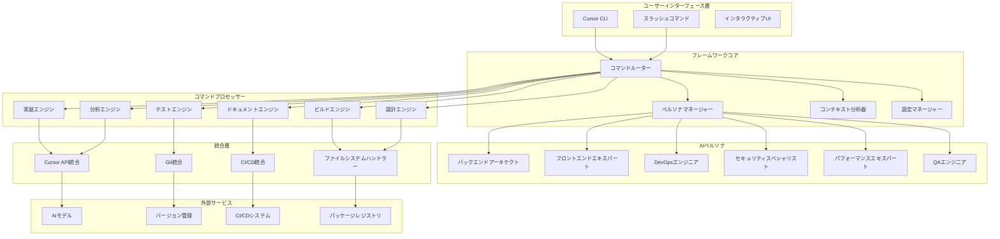

# 設計書


## 概要

SuperCursorフレームワークは、Cursor CLIを専門的な開発コマンド、インテリジェントAIペルソナ、高度な自動化機能で拡張する包括的な拡張システムです。このフレームワークは、Cursorの既存インフラストラクチャとシームレスに統合しながら、現代の開発ワークフローのための強力な新機能を提供するモジュラーアーキテクチャに従います。

## アーキテクチャ

### 高レベルアーキテクチャ



### コアコンポーネント

#### 1. コマンドルーター
- **目的**: すべてのフレームワークコマンドの中央ディスパッチャー
- **責任**:
  - スラッシュコマンドの解析と検証
  - 適切なプロセッサーへのコマンドルーティング
  - コマンドチェーンと合成の処理
  - コマンド履歴とキャッシュの管理

#### 2. ペルソナマネージャー
- **目的**: インテリジェントなコンテキスト認識AIペルソナ選択
- **責任**:
  - 現在の開発コンテキストの分析
  - 適切なペルソナの選択と有効化
  - ペルソナの切り替えと組み合わせの管理
  - ペルソナ固有の知識ベースの維持

#### 3. コンテキスト分析器
- **目的**: プロジェクトコンテキストと開発者の意図の深い理解
- **責任**:
  - コードベース構造とパターンの分析
  - 技術スタックとフレームワークの特定
  - 開発ワークフローパターンの追跡
  - プロジェクト知識グラフの維持

#### 4. 設定マネージャー
- **目的**: 柔軟な設定と権限管理
- **責任**:
  - 設定ファイルの読み込みと検証
  - 環境固有設定の管理
  - 権限とセキュリティポリシーの処理
  - 設定のホットリロード提供

## コンポーネントとインターフェース

### コマンドプロセッサー

#### 実装エンジン (`/sc:implement`)
```typescript
interface ImplementationEngine {
  generateCode(specification: string, context: ProjectContext): Promise<CodeGeneration>;
  analyzeRequirements(description: string): Promise<RequirementAnalysis>;
  createScaffolding(template: string, options: ScaffoldOptions): Promise<ProjectStructure>;
  integrateWithExisting(newCode: string, existingContext: CodeContext): Promise<Integration>;
}

interface CodeGeneration {
  files: GeneratedFile[];
  dependencies: Dependency[];
  configurations: Configuration[];
  tests: TestFile[];
  documentation: DocumentationFile[];
}
```

#### 分析エンジン (`/sc:analyze`)
```typescript
interface AnalysisEngine {
  analyzeCodebase(path: string, options: AnalysisOptions): Promise<CodebaseAnalysis>;
  identifyPatterns(files: string[]): Promise<PatternAnalysis>;
  assessQuality(code: string, metrics: QualityMetrics): Promise<QualityAssessment>;
  findDependencies(project: ProjectContext): Promise<DependencyGraph>;
}

interface CodebaseAnalysis {
  structure: ProjectStructure;
  technologies: TechnologyStack;
  patterns: ArchitecturalPattern[];
  metrics: CodeMetrics;
  issues: Issue[];
  recommendations: Recommendation[];
}
```

#### ビルドエンジン (`/sc:build`)
```typescript
interface BuildEngine {
  generateBuildConfig(project: ProjectContext): Promise<BuildConfiguration>;
  optimizeBuild(currentConfig: BuildConfiguration): Promise<OptimizedBuild>;
  setupPipeline(requirements: PipelineRequirements): Promise<Pipeline>;
  validateBuild(config: BuildConfiguration): Promise<ValidationResult>;
}

interface BuildConfiguration {
  scripts: BuildScript[];
  dependencies: BuildDependency[];
  environments: Environment[];
  optimizations: Optimization[];
}
```

### AIペルソナ

#### バックエンドアーキテクトペルソナ
```typescript
interface BackendArchitectPersona extends AIPersona {
  designAPI(requirements: APIRequirements): Promise<APIDesign>;
  optimizeDatabase(schema: DatabaseSchema): Promise<OptimizedSchema>;
  implementSecurity(endpoints: Endpoint[]): Promise<SecurityImplementation>;
  designMicroservices(monolith: MonolithStructure): Promise<MicroserviceArchitecture>;
}
```

#### フロントエンドエキスパートペルソナ
```typescript
interface FrontendExpertPersona extends AIPersona {
  designUI(requirements: UIRequirements): Promise<UIDesign>;
  optimizePerformance(components: Component[]): Promise<PerformanceOptimization>;
  implementAccessibility(ui: UIStructure): Promise<AccessibilityImplementation>;
  setupStateManagement(complexity: ComplexityLevel): Promise<StateManagementSetup>;
}
```

#### DevOpsエンジニアペルソナ
```typescript
interface DevOpsEngineerPersona extends AIPersona {
  setupInfrastructure(requirements: InfraRequirements): Promise<Infrastructure>;
  configureCI(project: ProjectContext): Promise<CIConfiguration>;
  implementMonitoring(services: Service[]): Promise<MonitoringSetup>;
  optimizeDeployment(current: DeploymentConfig): Promise<OptimizedDeployment>;
}
```

### 統合インターフェース

#### Cursor API統合
```typescript
interface CursorAPIIntegration {
  executeCommand(command: string, options: CursorOptions): Promise<CursorResult>;
  readFile(path: string): Promise<FileContent>;
  writeFile(path: string, content: string, options: WriteOptions): Promise<WriteResult>;
  searchCode(query: string, scope: SearchScope): Promise<SearchResult[]>;
  getProjectContext(): Promise<ProjectContext>;
}
```

#### ファイルシステムハンドラー
```typescript
interface FileSystemHandler {
  readDirectory(path: string, recursive: boolean): Promise<DirectoryListing>;
  createFile(path: string, content: string, permissions: FilePermissions): Promise<void>;
  updateFile(path: string, changes: FileChange[]): Promise<void>;
  deleteFile(path: string, options: DeleteOptions): Promise<void>;
  watchFiles(patterns: string[], callback: FileWatchCallback): Promise<FileWatcher>;
}
```

## データモデル

### プロジェクトコンテキスト
```typescript
interface ProjectContext {
  rootPath: string;
  name: string;
  type: ProjectType;
  technologies: TechnologyStack;
  structure: ProjectStructure;
  dependencies: Dependency[];
  configurations: Configuration[];
  metadata: ProjectMetadata;
}

interface TechnologyStack {
  languages: ProgrammingLanguage[];
  frameworks: Framework[];
  databases: Database[];
  tools: DevelopmentTool[];
  platforms: Platform[];
}
```

### コマンドコンテキスト
```typescript
interface CommandContext {
  command: string;
  arguments: string[];
  options: CommandOptions;
  workingDirectory: string;
  user: UserContext;
  project: ProjectContext;
  session: SessionContext;
}

interface SessionContext {
  id: string;
  startTime: Date;
  history: CommandHistory[];
  cache: SessionCache;
  preferences: UserPreferences;
}
```

### AIペルソナコンテキスト
```typescript
interface PersonaContext {
  activePersona: AIPersona;
  confidence: number;
  reasoning: string;
  alternatives: AIPersona[];
  specializations: Specialization[];
  knowledgeBase: KnowledgeBase;
}

interface AIPersona {
  id: string;
  name: string;
  description: string;
  expertise: ExpertiseArea[];
  activationTriggers: Trigger[];
  responseStyle: ResponseStyle;
  capabilities: Capability[];
}
```

## エラーハンドリング

### エラー階層
```typescript
abstract class FrameworkError extends Error {
  abstract code: string;
  abstract severity: ErrorSeverity;
  abstract recoverable: boolean;
}

class CommandError extends FrameworkError {
  code = 'COMMAND_ERROR';
  severity = ErrorSeverity.HIGH;
  recoverable = true;
}

class PersonaError extends FrameworkError {
  code = 'PERSONA_ERROR';
  severity = ErrorSeverity.MEDIUM;
  recoverable = true;
}

class IntegrationError extends FrameworkError {
  code = 'INTEGRATION_ERROR';
  severity = ErrorSeverity.HIGH;
  recoverable = false;
}
```

### エラー回復戦略
1. **自動リトライ**: 指数バックオフによる一時的な障害の処理
2. **優雅な劣化**: 高度な機能が失敗した場合の基本機能へのフォールバック
3. **ユーザー通知**: 実行可能な提案を含む明確なエラーメッセージ
4. **ログ記録と監視**: デバッグのための包括的なエラー追跡

## テスト戦略

### 単体テスト
- **コマンドプロセッサー**: 個別のコマンドロジックと検証のテスト
- **ペルソナ**: ペルソナ選択と応答生成のテスト
- **統合**: 外部サービスのモックと統合ロジックのテスト
- **ユーティリティ**: ヘルパー関数とデータ変換のテスト

### 統合テスト
- **Cursor CLI統合**: Cursor環境内でのフレームワークコマンドのテスト
- **ファイルシステム操作**: 様々な権限でのファイル読み書き操作のテスト
- **AIモデル統合**: AIモデルの応答とエラーハンドリングのテスト
- **CI/CD統合**: 自動化環境でのフレームワーク動作のテスト

### エンドツーエンドテスト
- **完全ワークフロー**: コマンドから結果までの完全な開発ワークフローのテスト
- **マルチコマンドシナリオ**: コマンドチェーンとコンテキスト保持のテスト
- **エラーシナリオ**: エラーハンドリングと回復メカニズムのテスト
- **パフォーマンステスト**: 大規模コードベースでのフレームワークパフォーマンスのテスト

### テストインフラストラクチャ
```typescript
interface TestFramework {
  setupTestEnvironment(): Promise<TestEnvironment>;
  mockCursorAPI(): MockCursorAPI;
  createTestProject(template: ProjectTemplate): Promise<TestProject>;
  assertCommandOutput(command: string, expected: ExpectedOutput): Promise<void>;
  measurePerformance(operation: () => Promise<void>): Promise<PerformanceMetrics>;
}
```

## セキュリティ考慮事項

### 認証と認可
- **APIキー管理**: APIキーの安全な保存とローテーション
- **権限システム**: ファイルとシステム操作の細かい権限
- **ユーザーコンテキスト**: ユーザーアイデンティティとアクセス制御の維持
- **監査ログ**: セキュリティ監視のためのすべてのフレームワーク操作の追跡

### データ保護
- **機密データ処理**: コード内の機密情報の特定と保護
- **暗号化**: 設定ファイルとキャッシュデータの暗号化
- **ネットワークセキュリティ**: 外部サービスとの安全な通信
- **入力検証**: すべてのユーザー入力とコマンドパラメータのサニタイズ

### 安全なコーディング慣行
- **コードインジェクション防止**: 悪意のあるコードの実行防止
- **パストラバーサル保護**: ファイルパスの検証と不正アクセス防止
- **リソース制限**: リソース枯渇を防ぐための制限実装
- **依存関係セキュリティ**: セキュリティ脆弱性のための依存関係の監視と更新

## パフォーマンス最適化

### キャッシュ戦略
```typescript
interface CacheManager {
  get<T>(key: string): Promise<T | null>;
  set<T>(key: string, value: T, ttl?: number): Promise<void>;
  invalidate(pattern: string): Promise<void>;
  clear(): Promise<void>;
}

interface CacheConfiguration {
  providers: CacheProvider[];
  defaultTTL: number;
  maxSize: number;
  evictionPolicy: EvictionPolicy;
}
```

### リソース管理
- **メモリ最適化**: 大規模コードベースでの効率的なメモリ使用
- **CPU利用**: 独立した操作の並列処理
- **ネットワーク最適化**: リクエストバッチングとコネクションプーリング
- **ディスクI/O**: 効率的なファイル操作と一時ファイル管理

### 監視とメトリクス
```typescript
interface PerformanceMonitor {
  recordMetric(name: string, value: number, tags?: Record<string, string>): void;
  startTimer(name: string): Timer;
  recordError(error: Error, context?: Record<string, any>): void;
  getMetrics(timeRange: TimeRange): Promise<Metrics>;
}
```

この設計は、Cursor CLIとシームレスに統合しながら、強力なAI拡張開発機能を提供するSuperClaude風フレームワークの実装のための包括的な基盤を提供します。
