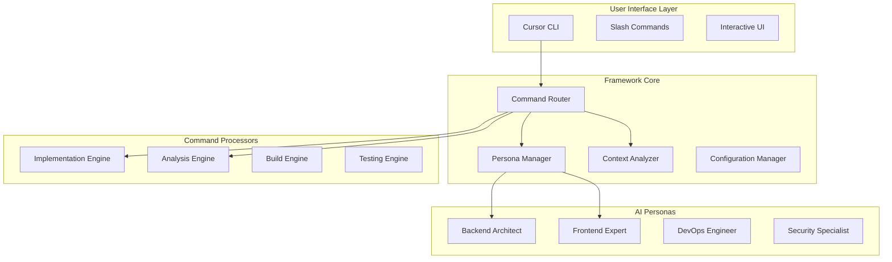

# SuperCursor Framework

> **AI-Enhanced Development Framework for Cursor CLI**  
> SuperClaude風の高度なAI支援開発体験を提供する包括的なフレームワーク

[](https://www.typescriptlang.org/)
[](https://nodejs.org/)
[](https://opensource.org/licenses/MIT)
[]()
[]()

## 🎯 概要

SuperCursor Frameworkは、Cursor CLIを専門的な開発コマンド、インテリジェントAIペルソナ、高度な自動化機能で拡張する次世代の開発支援システムです。

### ✨ 主要特徴

- 🤖 **AIペルソナシステム**: コンテキスト認識による専門ペルソナの自動選択
- ⚡ **高速コマンド処理**: 最適化されたルーティングとキャッシュシステム
- 🛡️ **エンタープライズセキュリティ**: 権限管理、暗号化、監査ログ
- 📊 **パフォーマンス監視**: リアルタイムメトリクスと最適化
- 🔧 **拡張可能アーキテクチャ**: プラグイン対応のモジュラー設計
- 🎨 **直感的UI/UX**: 美しく使いやすいインターフェース

## 🚀 クイックスタート

### 前提条件

- Node.js 18.0.0 以上
- npm 9.0.0 以上
- Cursor CLI (推奨)

### インストール

```bash
# リポジトリのクローン
git clone https://github.com/yohi/supercursor-framework.git
cd supercursor-framework

# 依存関係のインストール
npm install

# 開発用ビルド
npm run build

# CLIツールとしてグローバルインストール
npm link
```

### 基本的な使用方法

```bash
# フレームワークの初期化
supercursor init

# プロジェクト分析
/sc:analyze --deep --output json

# AIペルソナによるコード実装
/sc:implement "REST APIエンドポイントの作成" --persona backend

# テスト生成
/sc:test --coverage 80 --type unit,integration

# プロジェクトビルド最適化
/sc:build --optimize --target production
```

## 📋 コマンドリファレンス

### 🔨 実装・開発コマンド

| コマンド | 説明 | 例 |
|---------|------|---|
| `/sc:implement` | AI支援コード生成 | `/sc:implement "ユーザー認証システム" --persona security` |
| `/sc:analyze` | コードベース分析 | `/sc:analyze --pattern mvc --metrics quality` |
| `/sc:build` | ビルド設定最適化 | `/sc:build --optimize --env production` |
| `/sc:test` | テスト生成・実行 | `/sc:test --type e2e --coverage 90` |

### 🎭 ペルソナ管理

| コマンド | 説明 | 例 |
|---------|------|---|
| `/sc:persona list` | 利用可能ペルソナ一覧 | `/sc:persona list --active` |
| `/sc:persona switch` | ペルソナ切り替え | `/sc:persona switch frontend` |
| `/sc:persona train` | ペルソナ学習 | `/sc:persona train --data ./training-data` |

### 🛠️ ユーティリティ

| コマンド | 説明 | 例 |
|---------|------|---|
| `/sc:git` | インテリジェントGit操作 | `/sc:git commit --smart-message` |
| `/sc:document` | ドキュメント生成 | `/sc:document --format markdown --api` |
| `/sc:cleanup` | コード最適化 | `/sc:cleanup --unused --deps` |

## 🎭 AIペルソナシステム

### 利用可能なペルソナ

#### 🏗️ Backend Architect
- **専門分野**: API設計、データベース最適化、マイクロサービス
- **得意領域**: Node.js, Python, Go, Java
- **アクティベーション**: サーバーサイドコード、API仕様書

#### 🎨 Frontend Expert  
- **専門分野**: UI/UX設計、パフォーマンス最適化、アクセシビリティ
- **得意領域**: React, Vue, Angular, TypeScript
- **アクティベーション**: コンポーネント、スタイル、フロントエンドコード

#### ⚙️ DevOps Engineer
- **専門分野**: インフラ自動化、CI/CD、監視、デプロイメント
- **得意領域**: Docker, Kubernetes, AWS, Terraform
- **アクティベーション**: 設定ファイル、インフラコード

#### 🛡️ Security Specialist
- **専門分野**: 脆弱性検出、セキュリティ監査、暗号化
- **得意領域**: OWASP、ペネトレーションテスト、暗号化
- **アクティベーション**: セキュリティ関連キーワード、認証コード

#### ⚡ Performance Expert
- **専門分野**: パフォーマンス最適化、プロファイリング、監視
- **得意領域**: ベンチマーク、最適化、監視ツール
- **アクティベーション**: パフォーマンス問題、最適化要求

#### 🧪 QA Engineer
- **専門分野**: テスト戦略、品質保証、自動化テスト
- **得意領域**: Jest, Cypress, Selenium, テスト設計
- **アクティベーション**: テストコード、品質関連

### ペルソナ選択システム

```typescript
// 自動選択例
const context = await analyzeProject();
const persona = await personaManager.selectPersona({
  requiredCapabilities: ['api-design', 'database-optimization'],
  projectType: 'web-application',
  preferredExpertise: 'backend'
});
```

## 🏗️ アーキテクチャ



### コアコンポーネント

#### 🧭 Command Router
- スラッシュコマンドの解析と検証
- 適切なプロセッサーへのルーティング
- コマンド履歴とキャッシュ管理
- エラーハンドリングと回復

#### 🎭 Persona Manager
- コンテキスト認識によるペルソナ選択
- ペルソナの学習と評価
- 信頼度スコアリング
- 動的ペルソナ切り替え

#### 🔍 Context Analyzer
- プロジェクト構造の深層分析
- 技術スタックの自動検出
- コードパターンの識別
- 知識グラフの構築

#### ⚙️ Configuration Manager
- 環境別設定管理
- セキュリティポリシー
- パフォーマンス設定
- ホットリロード対応

## 🛠️ 開発

### 開発環境のセットアップ

```bash
# 開発モードでの実行
npm run dev

# ウォッチモードでのビルド
npm run build:watch

# テストの実行
npm run test

# テストカバレッジ
npm run test:coverage

# リンティング
npm run lint

# フォーマット
npm run format
```

### プロジェクト構造

```
supercursor-framework/
├── src/
│   ├── core/                 # コアフレームワーク
│   │   ├── command-router.ts
│   │   ├── persona-manager.ts
│   │   ├── context-analyzer.ts
│   │   └── config-manager.ts
│   ├── commands/             # コマンドプロセッサー
│   │   └── specialized/
│   ├── personas/             # AIペルソナ
│   │   ├── base-persona.ts
│   │   └── specialized/
│   ├── integrations/         # 外部統合
│   ├── types/                # 型定義
│   └── utils/                # ユーティリティ
├── tests/                    # テストスイート
│   ├── unit/
│   ├── integration/
│   └── e2e/
├── docs/                     # ドキュメント
└── examples/                 # 使用例
```

### コントリビューション

1. フォークしてブランチを作成
2. 機能実装・テスト追加
3. コードレビュー用PR作成
4. CI/CDパイプライン通過確認

### テスト戦略

- **単体テスト**: 各コンポーネントの独立テスト
- **統合テスト**: コンポーネント間の連携テスト
- **E2Eテスト**: 完全なワークフローテスト
- **パフォーマンステスト**: 大規模プロジェクトでの性能テスト

## 📊 パフォーマンス

### ベンチマーク

| 操作 | 処理時間 | メモリ使用量 |
|------|----------|-------------|
| プロジェクト分析 | < 2秒 | < 50MB |
| コード生成 | < 5秒 | < 100MB |
| ペルソナ選択 | < 0.5秒 | < 10MB |
| テスト生成 | < 3秒 | < 75MB |

### 最適化機能

- **インテリジェントキャッシュ**: LRU/LFU戦略
- **並列処理**: 独立操作の同時実行
- **増分分析**: 変更差分のみ処理
- **メモリ管理**: 自動ガベージコレクション

## 🔒 セキュリティ

### セキュリティ機能

- **権限管理**: ファイル・システム操作の細かい制御
- **暗号化**: 設定・キャッシュデータの暗号化
- **監査ログ**: 全操作の追跡可能性
- **入力検証**: インジェクション攻撃の防止

### セキュリティベストプラクティス

```typescript
// 権限チェック例
const hasPermission = await permissionManager.checkPermission(
  user,
  'file:write',
  '/path/to/file'
);

if (!hasPermission) {
  throw new SecurityError('ファイル書き込み権限がありません');
}
```

## 📖 ドキュメント

- [📚 APIドキュメント](./docs/api/README.md)
- [🎭 ペルソナガイド](./docs/personas/README.md)
- [🔧 設定リファレンス](./docs/configuration/README.md)
- [🏗️ アーキテクチャガイド](./docs/architecture/README.md)
- [🚀 デプロイメントガイド](./docs/deployment/README.md)

## 🤝 コミュニティ

- [💬 Discussions](https://github.com/yohi/supercursor-framework/discussions)
- [🐛 Issues](https://github.com/yohi/supercursor-framework/issues)
- [📖 Wiki](https://github.com/yohi/supercursor-framework/wiki)
- [📧 Contact](mailto:support@supercursor.dev)

## 📄 ライセンス

MIT License - 詳細は [LICENSE](./LICENSE) ファイルを参照してください。

## 🙏 謝辞

このプロジェクトは以下のオープンソースプロジェクトの恩恵を受けています：

- [Cursor](https://cursor.so/) - AI-powered code editor
- [TypeScript](https://www.typescriptlang.org/) - Typed JavaScript
- [Node.js](https://nodejs.org/) - JavaScript runtime
- その他多くの素晴らしいオープンソースライブラリ

---

<div align="center">

**[⭐ Star this repository](https://github.com/yohi/supercursor-framework) if you find it useful!**

*Made with ❤️ by the SuperCursor Framework team*

</div>